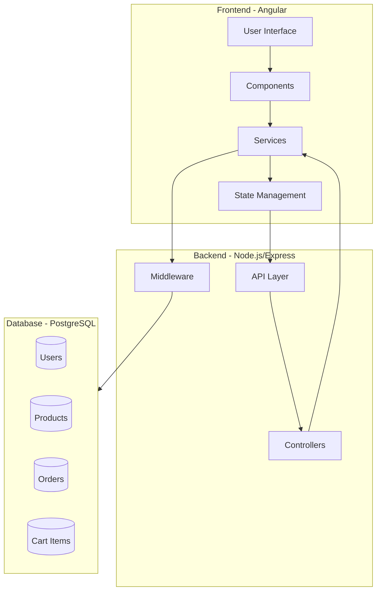
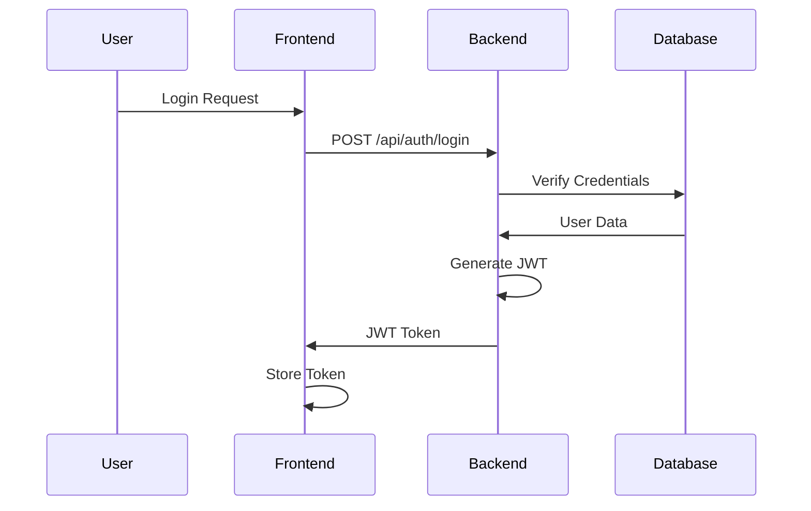

# SmartCart System Architecture

## 1. System Overview

SmartCart is a modern e-commerce platform built with a three-tier architecture:
- Frontend (Angular)
- Backend (Node.js/Express)
- Database (PostgreSQL)

## 2. Architecture Diagram



## 3. Component Details

### 3.1 Frontend (Angular)

#### Core Components
- **User Interface Layer**
  - Product Catalog
  - Shopping Cart
  - Checkout Process
  - User Authentication
  - Admin Dashboard

#### Services
- **API Services**
  - ProductService
  - CartService
  - OrderService
  - AuthService
  - UserService

#### State Management
- **Angular Services**
  - Cart State
  - User State
  - Product State

### 3.2 Backend (Node.js/Express)

#### API Layer
- **RESTful Endpoints**
  - /api/auth
  - /api/products
  - /api/cart
  - /api/orders
  - /api/users

#### Controllers
- AuthController
- ProductController
- CartController
- OrderController
- UserController

#### Services
- Authentication Service
- Product Service
- Cart Service
- Order Service
- User Service

#### Middleware
- Authentication Middleware
- Error Handling Middleware
- Request Validation Middleware
- Logging Middleware

### 3.3 Database (PostgreSQL)

#### Schema Design
```sql
-- Users Table
CREATE TABLE users (
    id SERIAL PRIMARY KEY,
    email VARCHAR(255) UNIQUE NOT NULL,
    password VARCHAR(255) NOT NULL,
    role VARCHAR(50) NOT NULL,
    created_at TIMESTAMP DEFAULT CURRENT_TIMESTAMP
);

-- Products Table
CREATE TABLE products (
    id SERIAL PRIMARY KEY,
    name VARCHAR(255) NOT NULL,
    description TEXT,
    price DECIMAL(10,2) NOT NULL,
    stock INTEGER NOT NULL,
    image_url VARCHAR(255),
    created_at TIMESTAMP DEFAULT CURRENT_TIMESTAMP
);

-- Orders Table
CREATE TABLE orders (
    id SERIAL PRIMARY KEY,
    user_id INTEGER REFERENCES users(id),
    total_amount DECIMAL(10,2) NOT NULL,
    status VARCHAR(50) NOT NULL,
    created_at TIMESTAMP DEFAULT CURRENT_TIMESTAMP
);

-- Order Items Table
CREATE TABLE order_items (
    id SERIAL PRIMARY KEY,
    order_id INTEGER REFERENCES orders(id),
    product_id INTEGER REFERENCES products(id),
    quantity INTEGER NOT NULL,
    price DECIMAL(10,2) NOT NULL
);

-- Cart Items Table
CREATE TABLE cart_items (
    id SERIAL PRIMARY KEY,
    user_id INTEGER REFERENCES users(id),
    product_id INTEGER REFERENCES products(id),
    quantity INTEGER NOT NULL,
    created_at TIMESTAMP DEFAULT CURRENT_TIMESTAMP
);
```

## 4. Data Flow


## 5. Security Architecture

### 5.1 Authentication Flow


### 5.2 Authorization
- Role-based access control (RBAC)
- JWT-based authentication
- Secure password hashing with bcrypt
- CORS protection
- Input validation and sanitization

## 6. Error Handling

### 6.1 Error Flow


## 7. Scalability Considerations

1. **Horizontal Scaling**
   - Stateless backend design
   - Load balancing ready
   - Database connection pooling

2. **Performance Optimization**
   - Database indexing
   - Caching strategies
   - Lazy loading in frontend
   - API response compression

3. **Monitoring and Logging**
   - Request logging
   - Error tracking
   - Performance metrics
   - User activity monitoring

## 8. Development Workflow


## 9. Deployment Architecture

